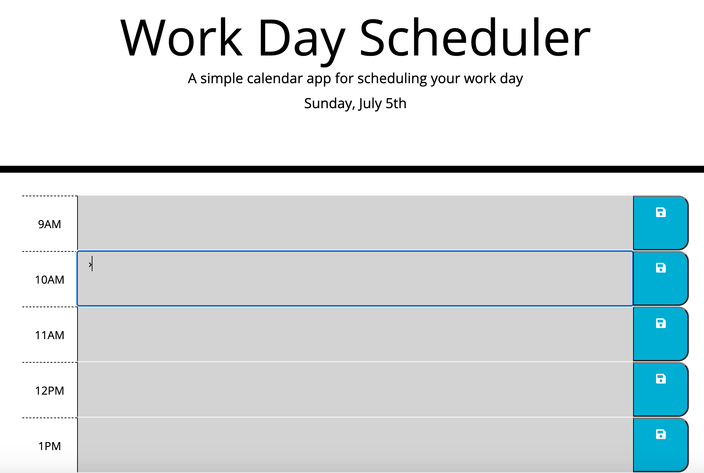

# Work Day Scheduler

## Purpose
Create a scheduler for a 9am - 5pm workday that uses moments.js to get the exact date / time.  Tasks / plans can be added to the schedule and saved.

## Built With
* HTML
* CSS
* JavaScript
* jQuery
* Bootstrap
* Moments.js

## Website
https://jonprine.github.io/work-day-scheduler/

## Contribution
Made by Jon Prine

## Screenshots of Finished Page

